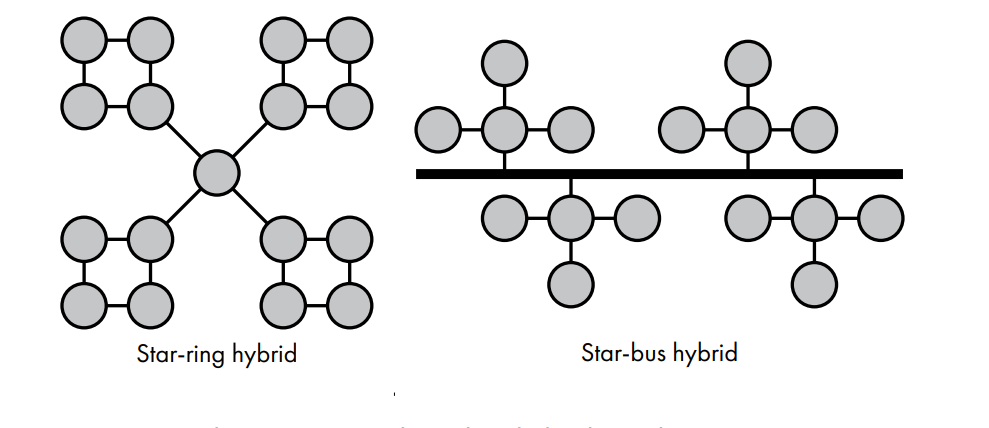
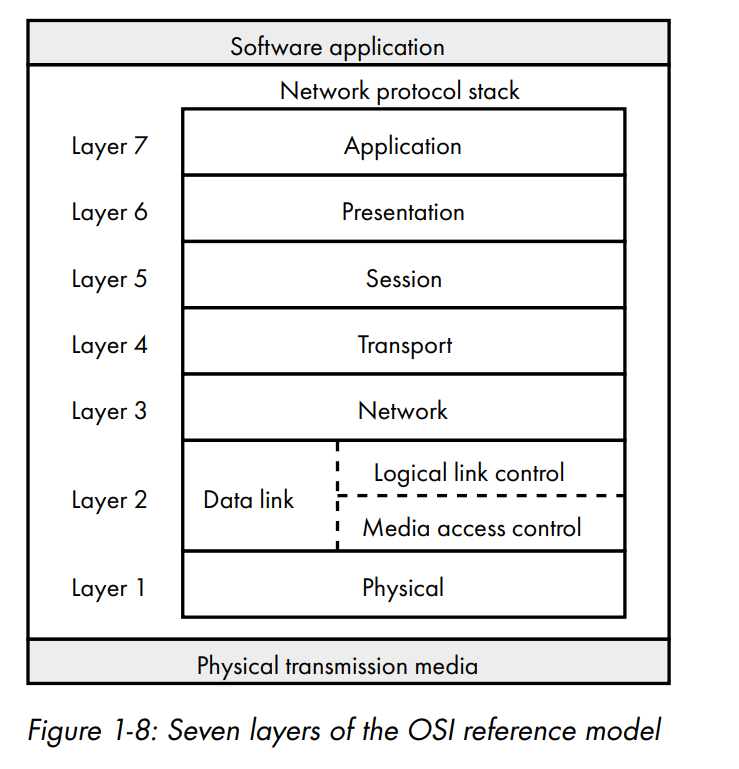
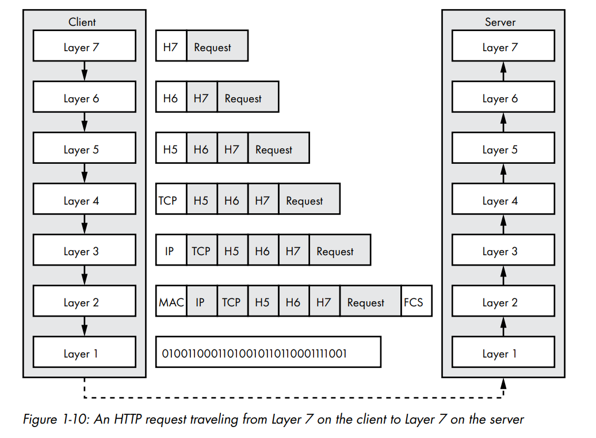
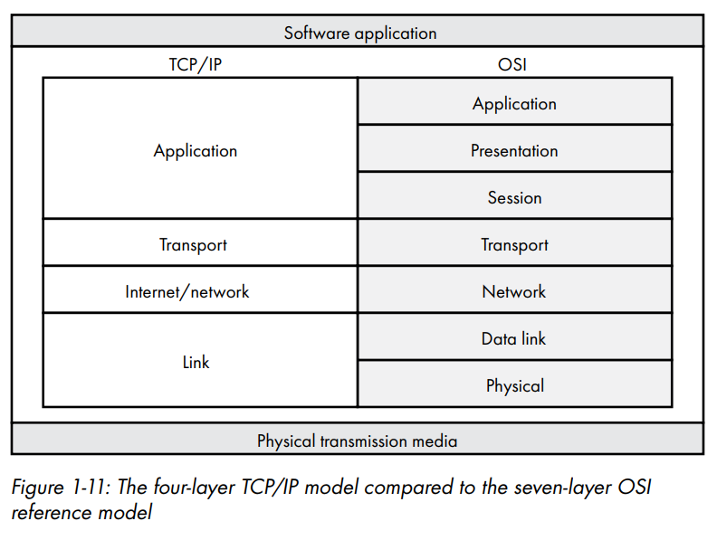
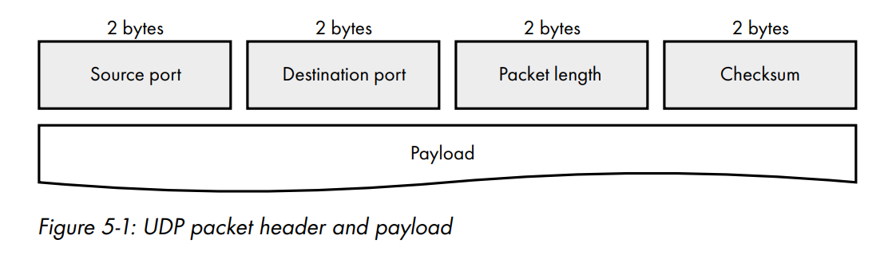

# network programming with go

## general info

written by Adam Woodbeck and Jerremy Bowers, both senior lvl SWE's at [barracuda](https://www.barracuda.com/) a software company specializing in networking and security.

the book claims it will teach you how to write idiomatic go code to share data in a secure and reliable way.

## gems from the book

pg. 36: damn the onus _is_ on us

> Most of our network applications rely on the transport layer protocols
> to handle the error correction, flow control, retransmission, and transport
> acknowledgment of each segment. However, the TCP/IP model doesn’t
> require every transport layer protocol to fulfill each of those elements. UDP is
> one such example. If your application requires the use of UDP for maximal
> throughput, the onus is on you to implement some sort of error checking or
> session management, since UDP provides neither

pg. 129: funny ass comparison of tcp vs udp

> When it comes to sending and receiving data, UDP is uncivilized compared
> to TCP. For example, let’s assume your neighbor baked you a pie and wants
> to give it to you. Using TCP to communicate is like your neighbor shouting
> a greeting from her window (her socket address) to your open window (your
> socket address). You hear her greeting and return a greeting of your own
> (the TCP handshake). Your neighbor then delivers your pie. You accept it and
> thankfully acknowledge the pie (the data transfer). You then both exchange
> farewells and go about your business (the termination). By contrast, using
> UDP to communicate is like your neighbor abruptly throwing the pie at your
> window, whether it’s open or not, and awaiting no confirmation that you
> received it

## ch.1, an overview of networked systems

### topologies and nodes

- node -> some device on the network. usually a computer.
- topology -> a connection of nodes. has six types.
  - point-to-point, being a direct connection
    - a daisy chain is a bunch of point to points in a chain. Rare nowadays.
  - bus, where one link is used to send traffic to every other device. Common in wireless networks but the traffic is encrypted inw ireless networks so its not that big of an issue.
  - ring, where the traffic needs to flow through all the other intermediary nodes before going to the desired node
  - and star, which is where one controller gets the traffic and sends it to the other node. common in wired networks.
  - mesh: expensive but most reliable. untennable in large scale networks.
  - hybrid: most networks are hybrids nowadays. check the image.
    

### banwidth vs latency

- bandwidth is the raw capacity of the pipe. Throughput is the amount of water flowing through that pipe (the book doesnt talk about throughput).
- the book states that _latency must not be overlooked_. And that latency can come from a bunch of different sources, including database lookups, serverside rendering, the physical distance from the server to the client, or blocking on the server due to a lack of a well designed concurrency model (shameless go shill).

### The OSI (Open Systems Interconnection) _Reference_ Model

- Everybody knows the OSI layer. It's more educational than a strict representation of reality. Developed in the 1970s.
- The layers
  - L7 -> mostly for resources. applications use this.
  - L6 -> presentation layer. _Encryption, decryption, and data encoding are examples of l6 functions._
  - L5 -> session layer. supposed to be a protocol for keeping sessions alive. Outdated imo.
  - L4 -> everybodies favourite! the transport layer. It controls the (un)reliability of the data transmitted through a network, and **demultiplexes traffic to applications**. IP gets packets from host to host, but TCP / UDP actually routes it to applications at the OS layer.
  - L3 -> for identifying hosts and networks on the internet. IP "addresses" were named that way because of their parallel to IRL counterparts. the OSI model defines L3 as the layer where **routing** (hence why a router is called an L3 device), addressing (IP), multicasting (where one device sends a message to a group of multiple devices, think sending a message to all the devices on a home network by sending it to the router.), and traffic control (queues and stuff for overloaded networks, idk how this works that well)
    - L3 is an abstraction on top of physical mediums of data transfer. a device communicating wirelessly can communicate with one speaking over the wire easily with the abstractions that L3 provides.
    - L3 protocols (from the book):
      - Internet Protocol version 4 (IPv4), Internet Protocol version 6 (IPv6), Border Gateway Protocol (BGP), Internet Control Message Protocol (ICMP), Internet Group Management Protocol (IGMP), and the Internet Protocol Security (IPsec) suite
      - TODO: study these more in depth
  - L2 and L1 -> l2 is a switch usually. intranetwork comms. L1 is just bits. a layer 2 message is called a frame.
    - ARP translates an IP into a MAC address  
      

### encapsulation

- as data moves up the network stack, it is decapsulated, up until the point where its a human readable l7 message which the server interprets. As it moves down, it gets more metadata added (encapsulated on-)to it so that it can actually be understood by the machines on the internet, ultimately resulting in it becoming a non readable mess of bits. Beautiful.

### tcp ip model (and it vs the osi model)

- the tcp IP model was developed by DARPA (some defense agency) for military grade comms. It influenced the rest of the world later on.

> [!NOTE]
> TODO: study DNS and DHCP deeper. maybe implement DNS from scratch in go.

## ch.2 resource location and traffic routing

TODO: finish this deeply

> To write effective network programs, you
> need to understand how to use human readable names to identify nodes on the
> internet, how those names are translated into
> addresses for network devices to use, and how traffic
> makes its way between nodes on the internet, even if
> they’re on opposite sides of the planet. This chapter
> covers those topics and more

## ch.5 unreliable UDP communication

### takeaways

the mental model is simple here. just focus on the tradeoffs of UDP. Mostly talks about the interfaces and functions which we use to work with udp sockets in go `net.ListenPacket`, `net.Dial`; and to write and read from those sockets `s.WriteTo`, `s.ReadFrom`.

net.Dial messed me up first using it, because I was like how tf am I _directly listening_ to the port specified. turns out im not.

calling net.Dial _creates an ephemeral port which can `write` to the `specified remote address` and `reads` messages addressed `back to the ephemeral port from the specified remote address`_

UDP is a datagram / message oriented protocol, at the kernel level **either a message / datagram gets sent fully or fails**. That's again why packet fragmentation is problematic. So when sending a UDP message, we can (probably) be sure that it either got sent fully, or it errored. No partials.
^figured this out while writing the code [in the dial_test.go example](./network-book-examples/ch5/dial_test.go) by hand

~~when writing tests, you want to fatal everytime theres an error (usually) because its supposed to model the perfect way the code should work. That's why we call t.Fatal a lot.~~ -> bad

### chapter summary

> Although most networking applications take
> advantage of TCP’s reliability and flow control, the less popular User Datagram Protocol
> (UDP) is nonetheless an important part of the
> TCP/IP stack. UDP is a simple protocol with minimal
> features. Some applications do not require TCP’s feature
> set and session overhead. Those applications, like domain
> name resolution services, opt to use UDP instead.

^ hey, we are one of those applications!

the [udp rfc](https://www.rfc-editor.org/info/rfc768/) is hilariously small

- UDP does not make sure the message got sent (no 3 way handshake)
- it does not guarantee they are sent in order, nor does it open up a session and provide flow control. veru lightweight.
  - this advertently allows for one udp message to be _multicast_ (sent to one ip / load balancer and forgotten about) whereas with tcp youd need to keep a connection open with all those devices
- max packet length is 65,535 bytes but application layer protocols often limit byte size to avoid `packet fragmentation`
  - packet fragmentation is best avoided by the application itself usually, some ppl have automated mechanisms regaridng it though
- UDP's checksum is calculated by converting the whole packet into 16 bit intergers, taking ones complement (wrapping the bits if 16 bit addition overflows). [theres also a special rule where if its all zeros, they store it as all ones]

examples can be seen in [network-book-examples/ch5/](./network-book-examples/ch5/)

## ch. 6 ensuring UDP reliability
